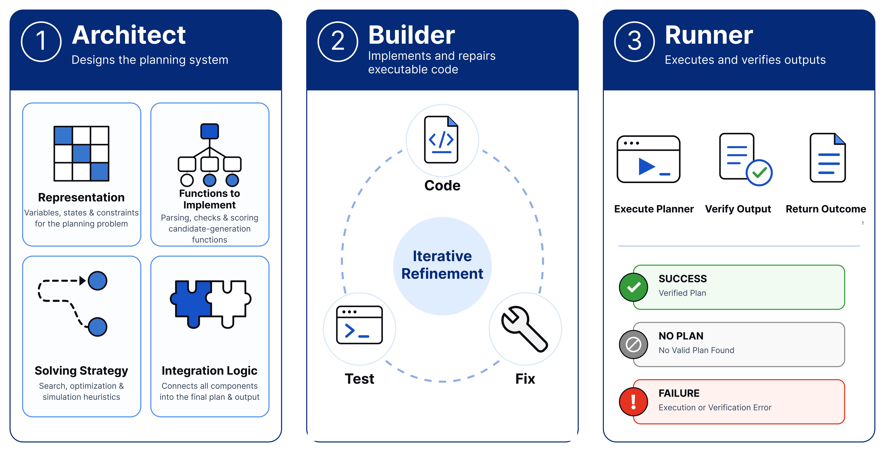

<h1 align="center">PlanForge: Synthesizing Planners from Natural Language with an LLM-Driven Architect–Builder–Runner Pipeline</h1>

<p align="center"><b>Official Implementation of PlanForge</b></p>

<p align="center">
  <a href="#">Sarvesh Baskar</a><sup>1*</sup>,
  <a href="#">Raviteja Bommireddy</a><sup>2*</sup>,
  <a href="#">Saksham Kumar Sharma</a><sup>1</sup>,
  <a href="#">Harsha Kokel</a><sup>3</sup>,
  <a href="#">Manas Gaur</a><sup>1</sup>,
  <a href="#">Michael Katz</a><sup>3</sup>,
  <a href="#">Shirin Sohrabi</a><sup>3</sup>,
  <a href="#">Kavitha Srinivas</a><sup>3</sup>
  <br>
  <sup>1</sup><i>University of Maryland, Baltimore County, USA</i> &nbsp;|&nbsp;
  <sup>2</sup><i>IIITDM, India</i> &nbsp;|&nbsp;
  <sup>3</sup><i>IBM Research, USA</i>
  <br>
  <sup>*</sup><i>Equal contribution</i>
</p>

<p align="center">
  <a href="https://PlanForge-ABR.github.io/"></a>
  <a href="https://arxiv.org"></a>
  <a href="https://github.com/PlanForge-ABR/PlanForge_ABR_pipeline"></a>
  <a href="LICENSE"></a>
</p>

<p align="center">
  <a href="#1-overview--paper-terminology"><b>Overview</b></a> &nbsp;•&nbsp;
  <a href="#2-directory--repository-layout"><b>Repository Layout</b></a> &nbsp;•&nbsp;
  <a href="#3-benchmark-families--metrics"><b>Evaluation Metrics</b></a> &nbsp;•&nbsp;
  <a href="#5-experiment-execution-guide"><b>Experiments Guide</b></a>
</p>

<br>

<p align="center">
  
</p>

<p align="center">
  <i><b>PlanForge Framework Overview.</b> Given a natural-language domain description and development instances, the <b>Architect</b> formulates the state schema and solver blueprint, the <b>Builder</b> synthesizes executable Python code with repair feedback, and the deterministic <b>Runner</b> executes the compiled program deterministically across unseen instances with zero test-time API query cost.</i>
</p>

<br>
<hr>

> [!IMPORTANT]
> **Reference Codebase Notice**: This repository contains the reference implementation and experiment scripts used for the **PlanForge** paper. Benchmark datasets (`data/`) and heavy generation artifacts are intentionally omitted from version control due to file size limits. Consequently, this repository is provided primarily for **code auditing, architectural reference, and methodology inspection**. The scripts will not execute out-of-the-box without manually downloading and placing the dataset files into the expected directory paths.

---

## 1. Overview & Paper Terminology

PlanForge operates across three distinct phases:
1. **Architect**: Designs the planner blueprint by specifying state representation, required function signatures, solving strategy, and integration contracts.
2. **Builder**: An LLM coding agent that compiles the blueprint into executable Python code within a test-driven refinement loop.
3. **Runner**: A deterministic execution engine that runs the compiled program on held-out test instances with **zero test-time LLM API queries**.

The repository is partitioned into the two pipeline variants evaluated in the paper:
- **`autonomous/`**: **PlanForge-Autonomous ABR** (Main proposed method). The Architect autonomously induces state representations, solving strategies, and function decompositions.
- **`guided/`**: **PlanForge-Guided ABR** (Ablation study variant). The Architect phase uses a human-prescribed rigid blueprint (PDDL/JSON schema + fixed search algorithms), isolating the Builder's function implementation.

---

## 2. Directory & Repository Layout

```text
PlanForge_ABR_pipeline/
├── README.md                          # Primary repository documentation & experiment guide
├── requirements.txt                   # Project dependencies (DSPy, OpenAI, Gemini, PDDL)
├── .env.example                       # API key environment configuration template
├── .gitignore                         # Exclusions for Python caches, outputs, and OS files
├── assets/                            # Teaser & framework architecture images
├── data/                              # Benchmark Datasets & Domain Task Files
│   ├── natural-plan/                  # NaturalPlan benchmark instances (calendar, meeting, trip)
│   ├── train/                         # PlanGen / ACPBench training & dev instances
│   ├── test/                          # PlanGen held-out test instances
│   ├── ACPBench_dataset_final/        # Complete ACPBench dataset collection
│   └── StructuredSAT/                 # StructureSAT CNF formula instances
│
├── autonomous/                        # PlanForge-Autonomous ABR (Main Proposed Method)
│   ├── NaturalPlan/                   # Natural Language Constraint Planning Benchmark (3 domains)
│   │   ├── calendar_scheduling/       # Autonomous calendar scheduling solver
│   │   ├── meeting_planning/          # Autonomous meeting route solver
│   │   └── trip_planning/             # Autonomous trip itinerary solver
│   │
│   ├── PlanGen/                       # Extended ACPBench Plan Generation Benchmark (15 domains)
│   │   ├── alfworld_final/            # Household embodied environment planning
│   │   ├── blocksworld_final/         # Block stacking domain
│   │   ├── depot_final/               # Depot logistics and crate stacking
│   │   ├── ferry_final/               # Vehicle transportation across locations
│   │   ├── floortile_final/           # Robot floor painting domain
│   │   ├── frogs_jumping_final/       # Frogs puzzle domain
│   │   ├── goldminer_final/           # Gold mining & laser navigation domain
│   │   ├── grid_final/                # Grid navigation with keys and locks
│   │   ├── grippers_final/            # Multi-robot gripper domain
│   │   ├── hanoi_final/               # Tower of Hanoi domain
│   │   ├── logistics_final/           # City truck & airport airplane logistics
│   │   ├── rovers_final/              # Mars rover navigation & soil sampling
│   │   ├── satellite_final/           # Satellite calibration & image acquisition
│   │   ├── swap_final/                # Bijection element swap domain
│   │   └── visitall_final/            # Grid coverage domain
│   │
│   └── StructureSAT/                  # Structured Constraint-Satisfaction Benchmark (9 domains)
│       ├── 3_sat_ABR/                 # 3-SAT Boolean Satisfiability solver
│       ├── automor_ABR/               # Permutation CSP Graph Automorphism solver
│       ├── ca_ABR/                    # Cellular Automata transition solver
│       ├── k-clique_ABR/              # Max Clique SAT solver
│       ├── k-domset_ABR/              # Dominating Set SAT solver
│       ├── k-vercov_ABR/              # Vertex Cover SAT solver
│       ├── k_color_ABR/               # Graph K-Coloring SAT solver
│       ├── ps_ABR/                    # Path Selection SAT solver
│       └── sr_ABR/                    # Subgraph Isomorphism SAT solver
│
└── guided/                            # PlanForge-Guided ABR (Ablation Variant)
    ├── NaturalPlan/                   # Guided NaturalPlan Framework (Architect-Builder Refinement)
    │   ├── calendar_scheduling/       # Guided calendar planner with fixed schema
    │   ├── meeting_planning/          # Guided meeting planner with fixed schema
    │   └── trip_planning/             # Guided trip planner with fixed schema
    │
    └── PlanGen_ACPBench/              # Guided PlanGen / ACPBench Framework
        ├── src/                       # CLI Coding Agent (codingagent.py), NL2State (nl2state.py), Search (search.py)
        ├── baselines/                 # Zero-Shot CoT baseline solver (zero_shot_dspy.py)
        ├── evaluation/                # ATLAS execution engine & VAL plan verifier
        ├── scope/                     # Re-implemented SCOPE baseline runner
        ├── test_case_generator/       # Unit test generators derived from training PDDL data
        └── tests/                     # Verification test suites
```

---

## 3. Benchmark Families & Metrics

| Benchmark | Description | Number of Domains | Evaluation Metrics |
| :--- | :--- | :---: | :--- |
| **NaturalPlan** | Unstructured natural-language planning (Trip, Meeting, Calendar) | 3 | **Success Rate (SR %)** & **Exact Match (EM %)** |
| **PlanGen** | ACPBench-based classical planning with long horizons (up to 600+ steps) | 15 | **VAL-Verified Plan-Generation Accuracy (%)** & **Plan-Existence Accuracy (%)** |
| **StructureSAT** | Structured constraint satisfaction & Boolean satisfiability | 9 | **SAT/UNSAT Prediction Accuracy (%)** & **Satisfying Assignment Success Rate (%)** |

---

## 4. Setup & Environment

### 4.1 Prerequisites
- **Python 3.12+**
- Recommended: Virtual environment (`venv`)

### 4.2 Installation
```bash
python3 -m venv venv
source venv/bin/activate
pip install -r requirements.txt
```

### 4.3 Environment Variables
For **Guided ABR** synthesis and prompt optimization experiments, set up your API keys:
```bash
export OPENAI_API_KEY="sk-..."
export GEMINI_API_KEY="AIza..."
export PYTHONPATH=$PYTHONPATH:.
```

---

## 5. Experiment Execution Guide

---

### Experiment 1: PlanForge-Autonomous ABR (Main Paper Results)

Runs the synthesized autonomous planners across all three benchmark families.

#### 1.1 NaturalPlan Benchmark (Autonomous)
Evaluates autonomous ABR solvers on trip, meeting, and calendar planning:
```bash
# Calendar Scheduling
cd autonomous/NaturalPlan/calendar_scheduling
python evaluate_calendar_scheduling.py

# Meeting Planning
cd autonomous/NaturalPlan/meeting_planning
python evaluate_meeting_planning.py

# Trip Planning
cd autonomous/NaturalPlan/trip_planning
python evaluate_trip_planning.py
```

#### 1.2 PlanGen Benchmark (Autonomous - 15 Domains)
Runs autonomous PlanGen solvers on held-out test instances validated by VAL:
```bash
# BlocksWorld Domain
cd autonomous/PlanGen/blocksworld_final
python main.py --split test

# Logistics Domain
cd autonomous/PlanGen/logistics_final
python main.py --split test

# Hanoi Domain
cd autonomous/PlanGen/hanoi_final
python main.py --split test
```

#### 1.3 StructureSAT Benchmark (Autonomous - 9 Domains)
Runs autonomous StructureSAT solvers to output satisfying assignments:
```bash
# 3-SAT Domain
cd autonomous/StructureSAT/3_sat_ABR
python main.py

# Graph K-Coloring Domain
cd autonomous/StructureSAT/k_color_ABR
python main.py

# Max Clique Domain
cd autonomous/StructureSAT/k-clique_ABR
python main.py
```

---

### Experiment 2: PlanForge-Guided ABR (Ablation Study)

Evaluates the Guided ABR variant where the state representation and search algorithms are fixed, and the Builder synthesizes the transition logic (`succ`, `is_goal`, `nl2state`).

#### 2.1 Guided PlanGen / ACPBench Synthesis
```bash
cd guided/PlanGen_ACPBench

# Step A: Generate Unit Test Cases from Training Data
bash generate_test_cases.sh

# Step B: Run CLI Coding Agent for Transition Code Synthesis (succ.py, is_goal.py)
python src/codingagent.py \
  --domain blocksworld \
  --goal "Implement succ.py and is_goal.py for domain 'blocksworld' and pass unit tests." \
  --project-root src/blocksworld \
  --provider gemini \
  --template src/CodingAgent.md \
  --model-name gemini-2.5-flash

# Step C: Optimize NL2State Prompt Module (DSPy)
python src/nl2state.py \
  --train data/train \
  --N 20 \
  --N_train 4 \
  --N_validation 10 \
  --domain blocksworld \
  --out dev_nl2state_result.json \
  --model gemini \
  --model_name gemini-2.5-flash \
  --src src

# Step D: Run Search Engine & VAL-backed ATLAS Evaluation
python src/search.py \
  --domain blocksworld \
  --timeout 20 \
  --strategy astar \
  --src src \
  --nl2state dev_nl2state_result.json \
  --out dev_search_result.json

bash evaluation/run_eval.sh
```

#### 2.2 Guided NaturalPlan
```bash
# Guided Calendar Scheduling
cd guided/NaturalPlan/calendar_scheduling
python main.py --search bfs --output outputs/calendar_predictions.csv

# Guided Meeting Planning
cd guided/NaturalPlan/meeting_planning
python main.py --search bfs --output outputs/meeting_predictions.csv

# Guided Trip Planning
cd guided/NaturalPlan/trip_planning
python main.py --search bfs --output outputs/trip_predictions.csv
```

---

### Experiment 3: Baseline Comparisons (CoT & SCOPE)

#### 3.1 Zero-Shot Chain-of-Thought (CoT) Baseline
Runs direct LLM generation without transition code compilation:
```bash
cd guided/PlanGen_ACPBench
bash baselines/run_baseline.sh
```

#### 3.2 SCOPE Baseline Evaluation
Runs the SCOPE framework runner on ACPBench / NaturalPlan:
```bash
cd guided/PlanGen_ACPBench
python run_scope_acpbench.py
```
